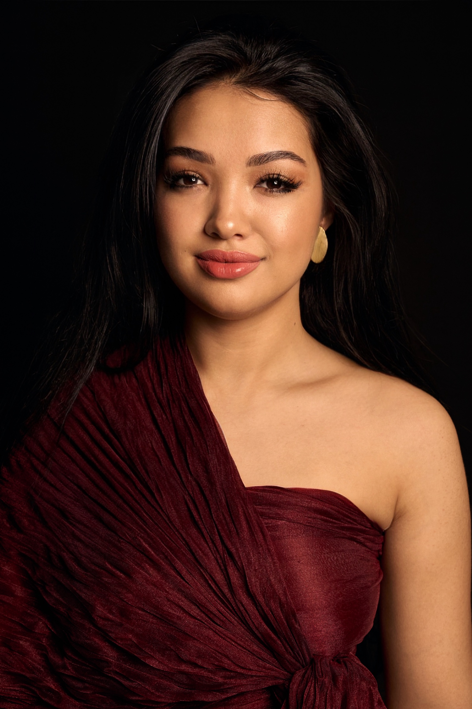
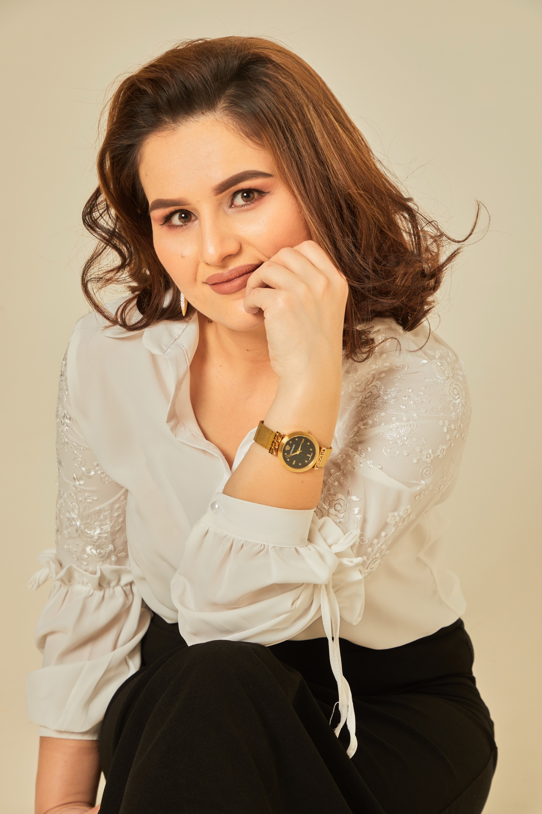

# DIVA CLUB — event post system · design brief

Client: **DIVA Women Networking Club** (Toshkent, Uzbekistan).
Deliverable: **9 social posts** = 3 distinct design directions × 3 ratios (9:16, 4:5, 1:1).
Mood requested by the client: **romantic** — elegant, feminine, warm, invitation-like.
Audience: Uzbek-speaking professional women. Language: **Uzbek (Latin)**.

---

## 0. CLIENT REDIRECT — supersedes anything below that conflicts with it

After seeing the first draft the client asked for five changes. They apply to
every post in the campaign and they outrank the rest of this brief:

1. **No circular portrait frames.** No avatar circles, no gold rings, no
   bordered ovals.
2. **Frameless.** No decorative border around the canvas, no engraved
   invitation frame, no outlined window around a photo (an outlined arch is a
   frame too).
3. **The people must be much bigger.** The two women are the hero of the post:
   placed large — cut out against the ground, full-bleed and cropped by the
   canvas edge, or dissolved into the ground with no visible edge. A face has
   to read instantly at thumbnail size.
4. **Modern, not vintage.** Contemporary fashion/editorial register: clean
   grid, confident negative space, crisp modern type setting, minimal
   decoration. Romance comes from colour, light, photography and type — not
   from filigree, wreaths or engraving.
5. **It must look professional.** No clip-art feel, no crowded ornament, no
   cheap effects.

Ornament budget: at most one or two deliberate accents per post, or none.
Cutouts live in `assets/cutout/` (transparent PNG, measured bounding boxes in
`assets/cutout/INDEX-cutout.md`); edge-free fades live in `assets/derived/`.

---

## 1. Copy — use these words, do not invent new ones

The client supplied this text. Every word below must appear on every post:

```
Diva klubi uchrashuvi
Mohinur Abdullayeva bilan
Mehmon spiker: psixolog, vrach psixoterapevt Sarvinoz Alisherovna

Uchrashuv mavzusi:
Shukronalik hissi. 1 ta katta maqsad uchun ongni tayyorlash
16-sentabr 11:00
Toshkent sh
```

**Allowed:** re-ordering the guest-speaker line into a caption stack
(`MEHMON SPIKER` / `Sarvinoz Alisherovna` / `psixolog, vrach psixoterapevt`),
line breaks, a trailing period on `Toshkent sh.`, case changes for small-caps
labels, and using the club name that already appears in the logo.

**Forbidden:** inventing anything the client did not give — no address, no venue
name, no phone number, no @handle, no website, no price, no "ro'yxatdan o'ting"
CTA, no year on the date, no English translation of the copy. Do not misspell
the names. Check character by character: **Mohinur Abdullayeva**,
**Sarvinoz Alisherovna**, **Shukronalik**, **16-sentabr**, **Toshkent**.

Numbers must use lining figures (`base.css` already forces this) — verify that
"1 ta katta maqsad" shows a real **1**, not an old-style `ı`.

---

## 2. Assets (all paths relative to this folder)

| File | What it is | Notes |
|---|---|---|
| `assets/logo.png` | Official lockup, maroon `#93061F`, transparent bg | 1838×1305 |
| `assets/logo-cream-trim.png` | Same lockup recoloured cream `#F7ECDE` | for dark grounds |
| `assets/logo-white-trim.png` | Same lockup in pure white | for photos |
| `assets/logo-trim.png` | Maroon, tightly trimmed | for light grounds |
| `assets/mohinur.jpg` | **Mohinur Abdullayeva** — host. Burgundy gown, black ground | 1717×2576 |
| `assets/sarvinoz.jpg` | **Sarvinoz Alisherovna** — guest speaker. White blouse, beige ground | 1717×2576 |
| `assets/orn/*.svg` | Ornaments — **black shapes on transparent, used as CSS masks** | see below |

Face-safe cropping is already solved — use the helper classes from `base.css`:

```html


```

Never distort a face: always `object-fit: cover`, never `fill`, never a
non-uniform `transform: scale(x, y)`. Never cover a face with text, a logo, or
an ornament. The logo must keep its proportions and never be recoloured to
anything outside the palette below.

Ornaments are masks, so they take any colour:

```css
.orn { -webkit-mask: url("assets/orn/flourish.svg") center/contain no-repeat; background: var(--gold); }
```

## 3. Palette & type (tokens live in `base.css`, use them)

```
--maroon #93061F   --maroon-rich #7A0519  --maroon-deep #5A0413  --maroon-ink #34020C
--cream  #FBF4EA   --ivory #FFFDF8        --blush #F4E3DD        --blush-deep #E8CDC6
--rose   #D9A8A4   --gold #C9A25B         --gold-soft #E3CB99    --gold-deep #A8813C
```

Maroon is the brand anchor (it is the logo colour). Gold is the accent — thin,
precious, never a thick slab. Cream/blush carry the romance. Do not introduce
hues outside this family (no purple, no teal, no black text).

Fonts are self-hosted and offline — **only these four**:
`--display` Playfair Display · `--serif` Cormorant Garamond ·
`--roman` Marcellus · `--sans` Jost (labels/small caps only, never headlines).

## 4. Technical contract

- One file per direction: `variant-a.html`, `variant-b.html`, `variant-c.html`.
- Each file is standalone: `<link rel="stylesheet" href="base.css">` +
  `<script src="lib.js"></script>` in `<head>` + one `<style>` block of its own.
  Put **all** of your CSS in that `<style>` block. `base.css` and `lib.js` are
  shared and **read-only** — do not edit them.
- `lib.js` reads `?r=9x16|4x5|1x1` and sets `<html data-r="...">`. Adapt with
  `html[data-r="9x16"] .canvas { ... }` etc.
- The post is the single `.canvas` element; `base.css` gives it the exact pixel
  size per ratio. Never set width/height on `.canvas` yourself.
- Render: `./build.sh a` (one variant, all ratios) or `./build.sh a:1x1`.
  Output lands in `out/` at final 1080px width (2× supersampled, LANCZOS).
- No network requests, no CDNs, no external images, no JS-driven layout.

## 5. The three directions must not look like each other

They should read as three different designers' work — different layout logic,
different ground, different photo treatment. Not a recolour of one layout.

- **A — "Modern maroon"**: deep maroon ground, both women placed large and
  frameless (cutouts or edge-free fades), a clean contemporary type block.
  Composed and confident rather than ceremonial.
- **B — "Ivory & blush"**: the light one — cream/blush ground, maroon ink,
  large frameless portraits, lots of air. Modern beauty-brand calm.
- **C — "Editorial"**: the dramatic one — photography-led, asymmetric,
  magazine-cover energy, oversized display type, a maroon wash over a
  full-bleed portrait. No frames, no inset circles.

## 6. Quality bar — every post is checked against this

1. **Nothing clipped.** No text, ornament, or photo edge cut off by the canvas.
   Content stays ≥ 56px from every edge (≥ 64px on 9:16).
2. **No overflow.** The layout fits; nothing scrolls out of the bottom.
3. **Ratio-native composition.** 9:16 is not a stretched 4:5. Re-think the
   composition per ratio: 9:16 gets vertical drama, 1:1 gets a tighter, more
   compact hierarchy (drop decorative air, not information).
4. **Hierarchy reads in 1.5 seconds** at thumbnail size: event → who → topic →
   when. Squint at it: the title and the date must survive.
5. **Contrast**: body/label text must stay legible (light text on maroon, maroon
   text on cream — never gold text smaller than ~22px on maroon).
6. **Optical alignment**: baseline grid feel, consistent gutters, centred things
   actually centred (watch letter-spacing on the last letter — use `text-indent`
   equal to the tracking on uppercase centred labels).
7. **Craft**: no stray 1px gaps, no banded gradients (use the `grain` class), no
   squashed photos, no muddy drop shadows, no default-looking browser rendering.

## 7. How to work

Render, then **look at the PNG with the Read tool** — judge with your eyes, not
by reading your CSS. Iterate until it is genuinely good. A post you have not
looked at is not finished.
